# digital-image-processing

Here are the programs that I wrote during the Digital Image Processing class in 2008, as well as some new experiments.

1. Grayscale to black-and-white
    1. [Thresholding](#thresholding-lab1_1c)
    2. [Floyd-Steinberg dithering](#floyd-steinberg-dithering-lab1_2c)
    3. [Jarvis-Judice-Ninke dithering](#jarvis-judice-ninke-dithering-lab1_3c)
    4. [Atkinson dithering](#atkinson-dithering-lab1_4c)
    5. [Ordered dithering](#ordered-dithering-lab1_5c)
    6. [Random dithering](#random-dithering-lab1_6c)
    7. [Clustered dithering](#clustered-dithering-lab1_7c)
2. Image scaling
    1. [Nearest-neighbor interpolation](#nearest-neighbor-interpolation-lab2_1c)
    2. [Bilinear interpolation](#bilinear-interpolation-lab2_2c)
3. [Alpha compositing](#alpha-compositing-lab3c)
4. Intensity transformations
    1. [Gamma correction](#gamma-correction-lab4_1c)
    2. [Linear contrast stretching](#linear-contrast-stretching-lab4_2c)
5. [Convolution](#convolution-lab5c)
6. [Median filter](#median-filter-lab6c)
7. [Segmentation](#segmentation-lab7c)

---
## Thresholding ([lab1_1.c](lab1_1/lab1_1.c))
| Input | Output (threshold = 100) |
| ----- | ------ |
| 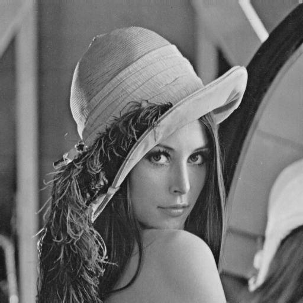 | 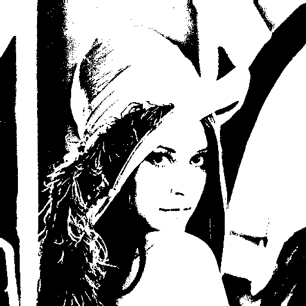 |

---
## Floyd-Steinberg dithering ([lab1_2.c](lab1_2/lab1_2.c))
| Input | Output |
| ----- | ------ |
|  |  |

---
## Jarvis-Judice-Ninke dithering ([lab1_3.c](lab1_3/lab1_3.c))
| Input | Output |
| ----- | ------ |
|  |  |

---
## Atkinson dithering ([lab1_4.c](lab1_4/lab1_4.c))
| Input | Output |
| ----- | ------ |
|  |  |

---
## Ordered dithering ([lab1_5.c](lab1_5/lab1_5.c))
| Input | Output (4x4 Bayer matrix) |
| ----- | ------ |
|  |  |

---
## Random dithering ([lab1_6.c](lab1_6/lab1_6.c))
| Input | Output (threshold = 100, noise = 40) |
| ----- | ------ |
|  | 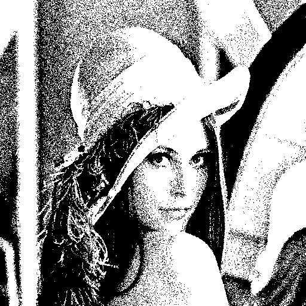 |

---
## Clustered dithering ([lab1_7.c](lab1_7/lab1_7.c))
| Input | Output |
| ----- | ------ |
|  | 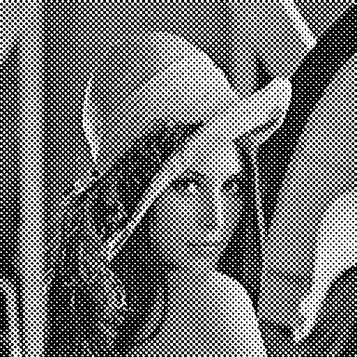 |

---
## Nearest-neighbor interpolation ([lab2_1.c](lab2_1/lab2_1.c))
| Input | Output (N = 5, cropped) |
| ----- | ------ |
|  | 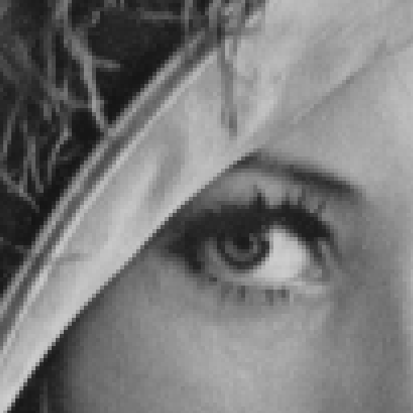 |

---
## Bilinear interpolation ([lab2_2.c](lab2_2/lab2_2.c))
| Input | Output (N = 5, cropped) |
| ----- | ------ |
|  | 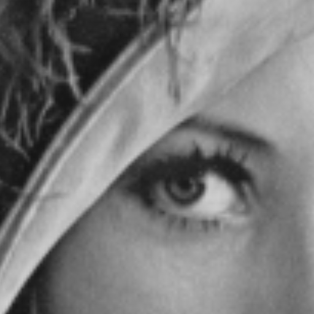 |

---
## Alpha compositing ([lab3.c](lab3/lab3.c))
| Input | Output |
| ----- | ------ |
| <ul><li>[Goldhill.png](images/Goldhill.png) as top</li><li>[Lena.png](images/Lena.png) as bottom</li><li>[Peppers.png](images/Peppers.png) as alpha channel</li></ul> | 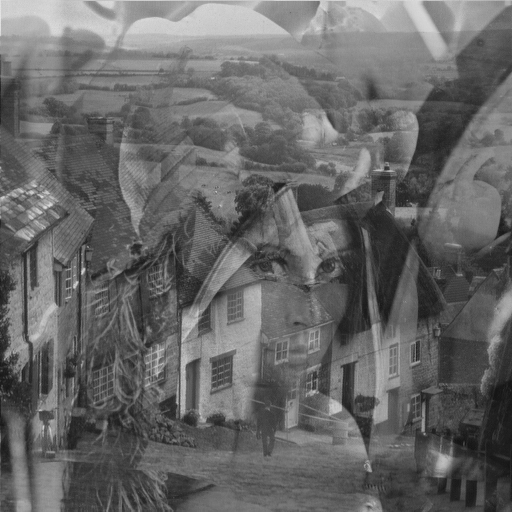 |

---
## Gamma correction ([lab4_1.c](lab4_1/lab4_1.c))
| Input | Output (c = 1.0, gamma = 0.6) |
| ----- | ------ |
|  | 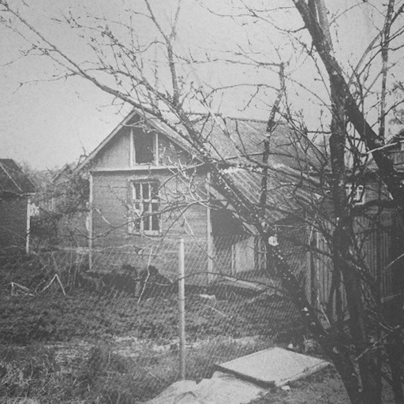 |
| 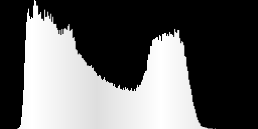 | 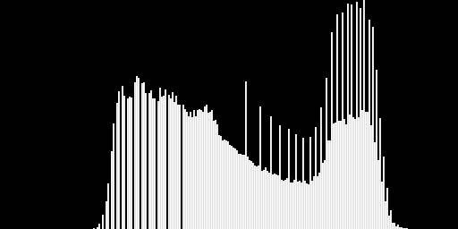 |

| Input | Output (c = 1.5, gamma = 1.5) |
| ----- | ------ |
|  | 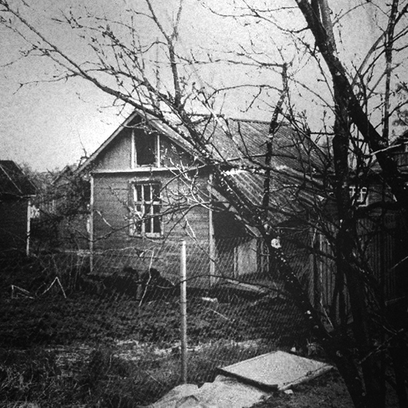 |
|  | 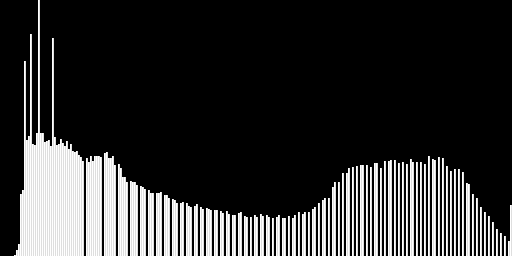 |

---
## Linear contrast stretching ([lab4_2.c](lab4_2/lab4_2.c))
| Input | Output (delta = 1000) |
| ----- | ------ |
| 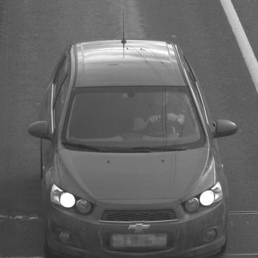 | 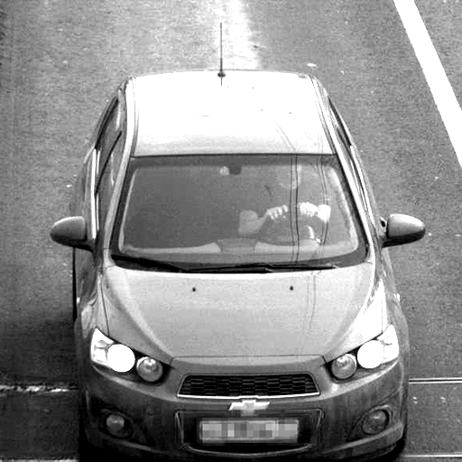 |
| 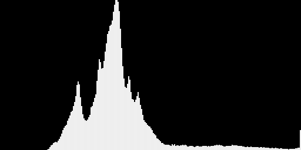 | 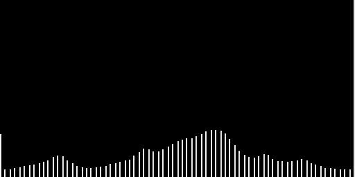 |

---
## Convolution ([lab5.c](lab5/lab5.c))
| Input | Output ([11x11 blur](kernels/Blur_11.txt) kernel) |
| ----- | ------ |
|  | 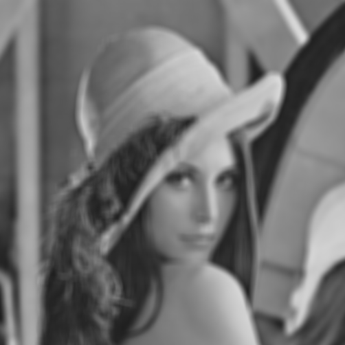 |

| Input | Output ([Sharp](kernels/Sharp.txt) kernel) |
| ----- | ------ |
| 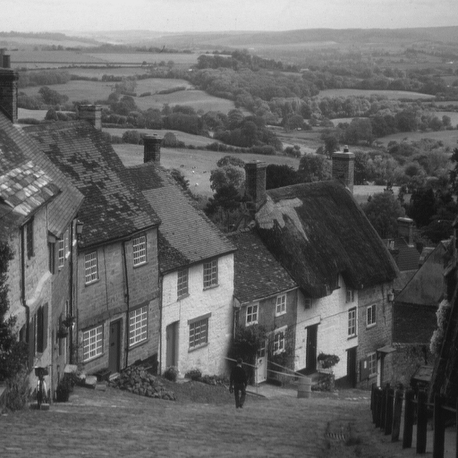 |  |

| Input | Output ([Vertical Sobel](kernels/Sobel_v.txt) kernel) |
| ----- | ------ |
| 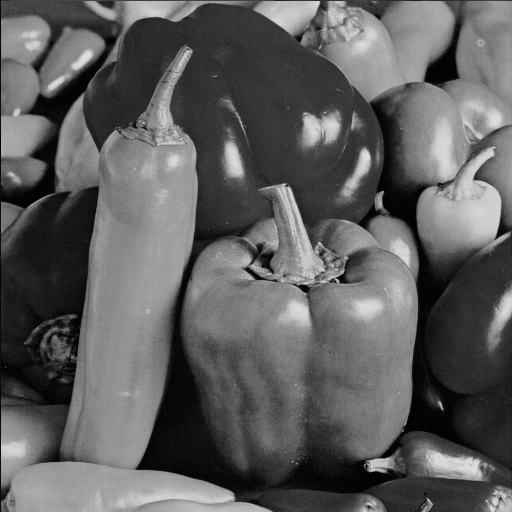 | 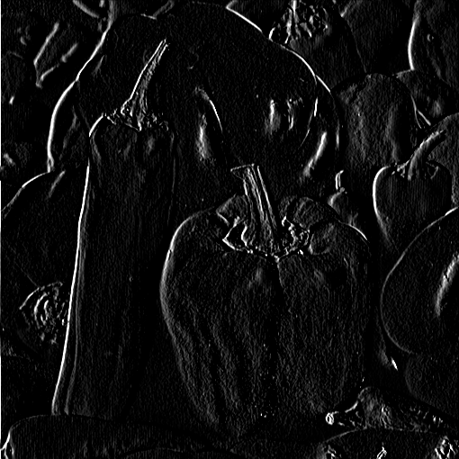 |

---
## Median filter ([lab6.c](lab6/lab6.c))
| Input | Output ([3x3 plus](apertures/Plus_3.txt) aperture) |
| ----- | ------ |
|  |  |

---
## Segmentation ([lab7.c](lab7/lab7.c))
| Input | Output (threshold = 128) |
| ----- | ------ |
|  | 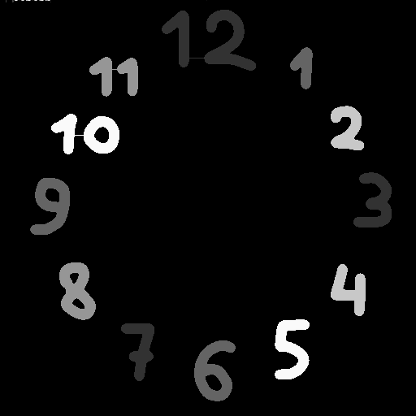 12 segments |

| Input (cropped) | Output (threshold = 80, cropped) |
| ----- | ------ |
| 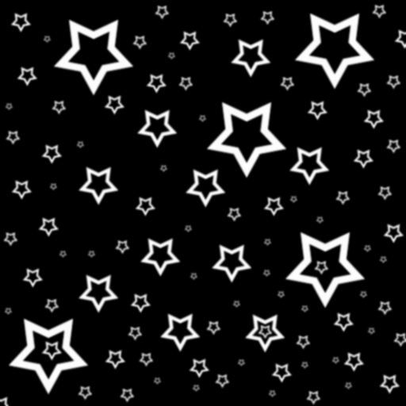 | 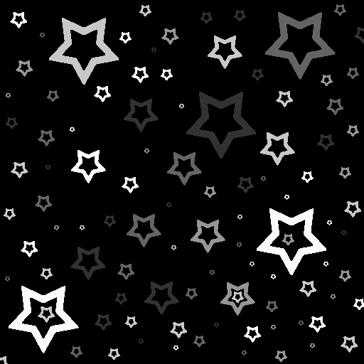 397 segments |

