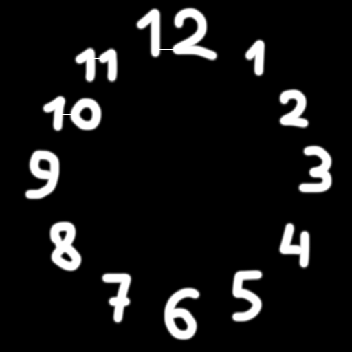

# digital-image-processing

Here are the programs that I wrote during the Digital Image Processing class in 2008, as well as some new experiments.

1. Grayscale to black-and-white
    1. [Thresholding](#thresholding)
    2. [Bit-plane slicing](#bit-plane-slicing)
    3. [Random dithering](#random-dithering)
    4. Ordered dithering
        1. [Bayer dithering](#bayer-dithering)
        2. [Clustered dithering](#clustered-dithering)
    5. Error-diffusion dithering
        1. [Floyd-Steinberg dithering](#floyd-steinberg-dithering)
        2. [Jarvis-Judice-Ninke dithering](#jarvis-judice-ninke-dithering)
        3. [Atkinson dithering](#atkinson-dithering)
2. Image scaling
    1. [Nearest-neighbor interpolation](#nearest-neighbor-interpolation)
    2. [Bilinear interpolation](#bilinear-interpolation)
3. [Alpha compositing](#alpha-compositing)
4. Intensity transformations
    1. [Gamma correction](#gamma-correction)
    2. [Linear contrast stretching](#linear-contrast-stretching)
    3. Histogram equalization
        1. [Histogram equalization](#histogram-equalization)
        2. [Adaptive histogram equalization](#adaptive-histogram-equalization)
5. [Convolution](#convolution)
6. [Median filter](#median-filter)
7. [Segmentation](#segmentation)

---
## [Thresholding](lab1_threshold/lab1_threshold.c)
| Input | Output (threshold = 100) |
| ----- | ------ |
|  |  |

---
## [Bit-plane slicing](lab1_bitplane/lab1_bitplane.c)
| Output (bit 6) | Output (bit 5) |
| ----- | ------ |
|  |  |

| Output (bit 4) | Output (bit 3) |
| ----- | ------ |
|  |  |

---
## [Random dithering](lab1_random/lab1_random.c)
| Input | Output (threshold = 100, noise = 40) |
| ----- | ------ |
|  |  |

---
## [Bayer dithering](lab1_bayer/lab1_bayer.c)
| Input | Output (4x4 Bayer matrix) |
| ----- | ------ |
|  |  |

---
## [Clustered dithering](lab1_cluster/lab1_cluster.c)
| Input | Output |
| ----- | ------ |
|  |  |

---
## [Floyd-Steinberg dithering](lab1_floyd/lab1_floyd.c)
| Input | Output |
| ----- | ------ |
|  |  |

---
## [Jarvis-Judice-Ninke dithering](lab1_jarvis/lab1_jarvis.c)
| Input | Output |
| ----- | ------ |
|  |  |

---
## [Atkinson dithering](lab1_atkinson/lab1_atkinson.c)
| Input | Output |
| ----- | ------ |
|  |  |

---
## [Nearest-neighbor interpolation](lab2_nearest/lab2_nearest.c)
| Input | Output (N = 5, cropped) |
| ----- | ------ |
|  |  |

---
## [Bilinear interpolation](lab2_bilinear/lab2_bilinear.c)
| Input | Output (N = 5, cropped) |
| ----- | ------ |
|  |  |

---
## [Alpha compositing](lab3/lab3.c)
| Input | Output |
| ----- | ------ |
| <ul><li>[Goldhill.png](images/Goldhill.png) as top</li><li>[Lena.png](images/Lena.png) as bottom</li><li>[Peppers.png](images/Peppers.png) as alpha channel</li></ul> |  |

---
## [Gamma correction](lab4_gamma/lab4_gamma.c)
| Input | Output (c = 1.0, gamma = 0.6) |
| ----- | ------ |
|  |  |
|  |  |

| Input | Output (c = 1.5, gamma = 1.5) |
| ----- | ------ |
|  |  |
|  |  |

---
## [Linear contrast stretching](lab4_contrast/lab4_contrast.c)
| Input | Output (delta = 1000) |
| ----- | ------ |
|  |  |
|  |  |

---
## [Histogram equalization](lab4_equalize/lab4_equalize.c)
| Input | Output |
| ----- | ------ |
|  |  |
|  |  |

---
## [Adaptive histogram equalization](lab4_ahe/lab4_ahe.c)
| Input | Output (block size = 100) |
| ----- | ------ |
|  |  |
|  |  |

---
## [Convolution](lab5/lab5.c)
| Input | Output ([11x11 blur](kernels/Blur_11.txt) kernel) |
| ----- | ------ |
|  |  |

| Input | Output ([Sharp](kernels/Sharp.txt) kernel) |
| ----- | ------ |
|  |  |

| Input | Output ([Vertical Sobel](kernels/Sobel_v.txt) kernel) |
| ----- | ------ |
|  |  |

---
## [Median filter](lab6/lab6.c)
| Input | Output ([3x3 plus](apertures/Plus_3.txt) aperture) |
| ----- | ------ |
|  |  |

---
## [Segmentation](lab7/lab7.c)
| Input | Output (threshold = 128) |
| ----- | ------ |
|  |  12 segments |

| Input (cropped) | Output (threshold = 80, cropped) |
| ----- | ------ |
|  |  397 segments |

